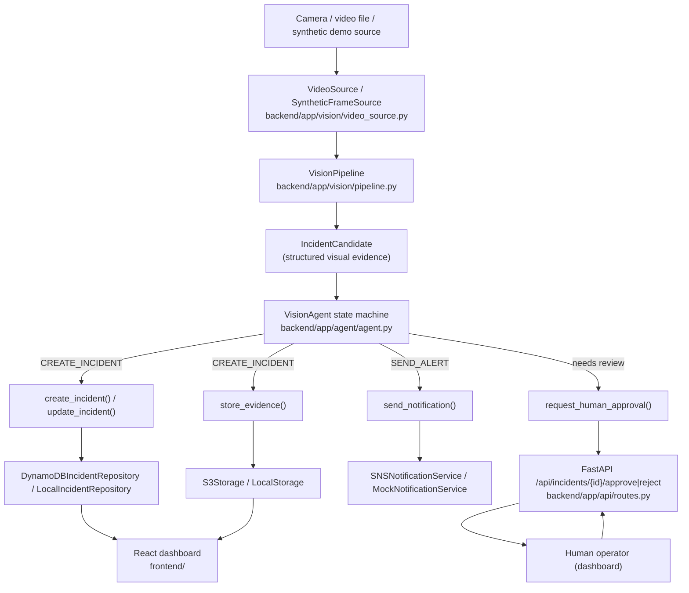
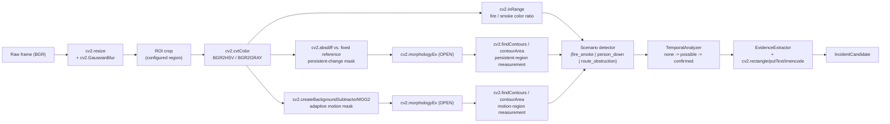
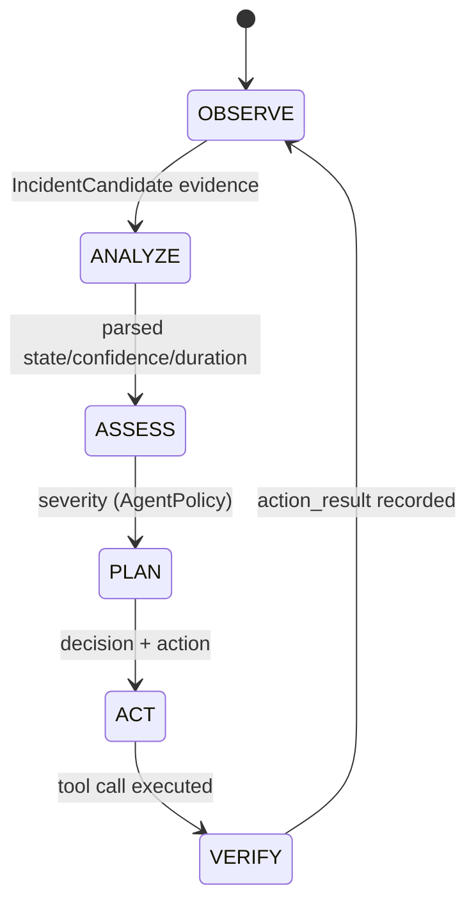
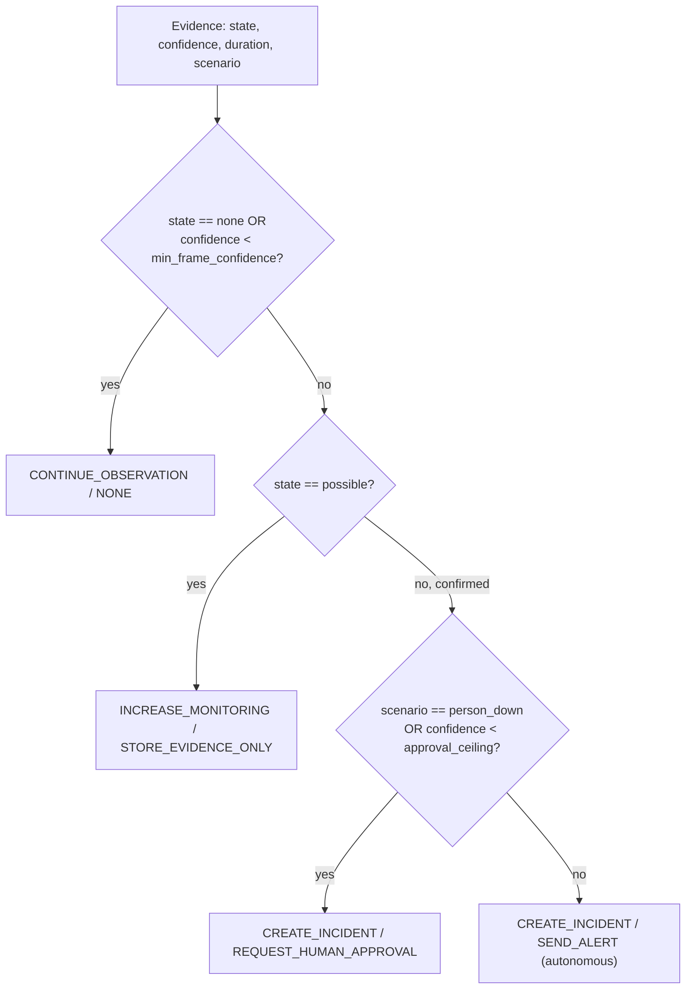
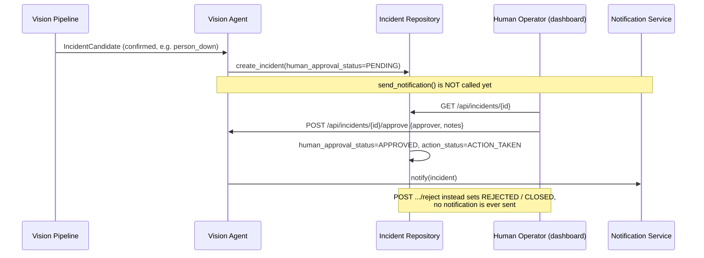

# System Architecture

Diagrams below reflect the actual implementation in this repository
(`backend/app/`), not an aspirational design. File paths are given next to
each component.

## 1. Overall system

## 2. OpenCV 5 vision pipeline

See `docs/opencv5_implementation.md` for the exact call sites and rationale.

## 3. Agentic workflow

Decision table (`backend/app/agent/policy.py::AgentPolicy.evaluate`):

## 4. AWS architecture

See `docs/aws-architecture.md` for the full diagram and service rationale.

## 5. Human-in-the-loop workflow

